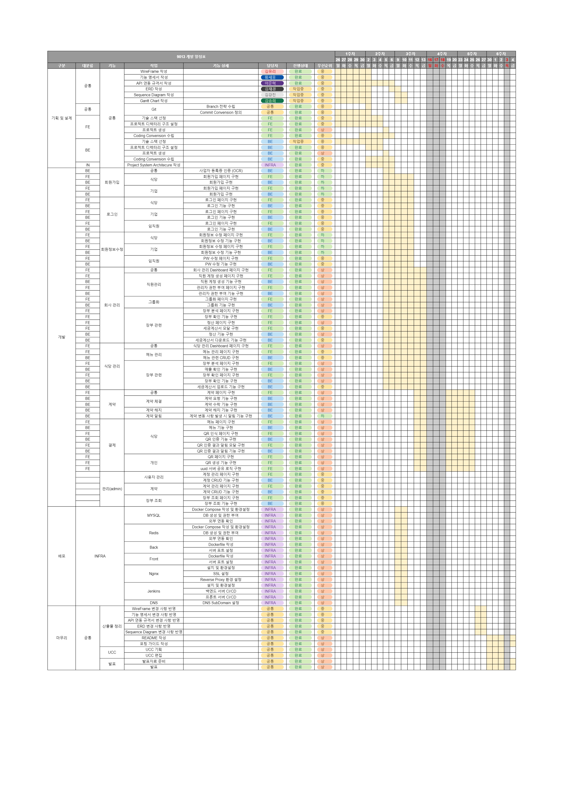
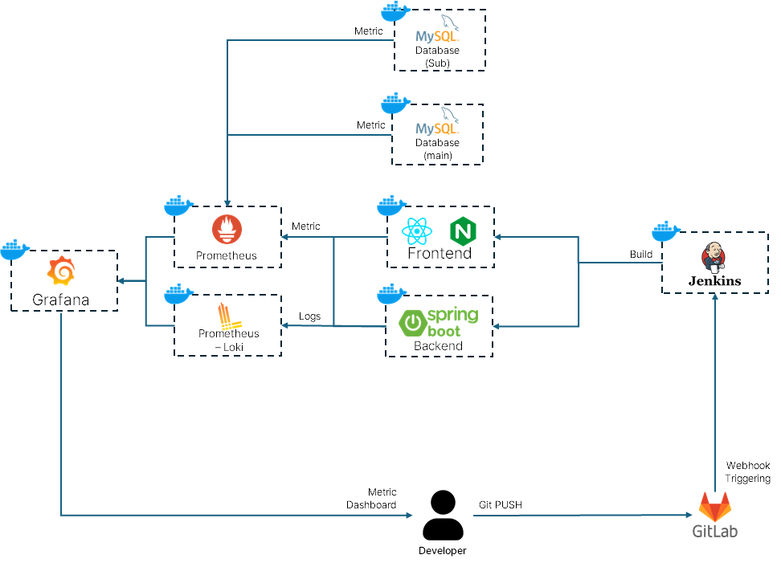

# 사내대장부 ( 기업과 제휴 식당 간의 디지털장부 서비스 )

**SSAFY 11기 특화 프로젝트 E201 슈팅스타**
2024.08.19 ~ 2024.10.11

# 목차

1. 프로젝트 개요
2. 서비스 화면
3. 개발 환경
4. 활용 기술
5. 프로젝트 산출물
6. 팀원 소개 및 역할
7. 개발 회고

---

</br>

# 1. 프로젝트 개요

## 1-1. 프로젝트 소개

기업과 제휴 식당 간의 수기 장부 작성 시스템을 디지털화한 온라인 장부 서비스입니다.

## 1-2. 기획 배경

현재 기업과 제휴된 식당 또는 공사 현장의 함바집에서는 직원들이 수기 장부나 종이 식권을 통해 거래 기록을 남기는 것이 일반적입니다. 이 과정에서 직원들은 점심시간에 하나뿐인 장부에 기록을 남기기 위해 긴 줄을 서서 기다리며, 직접 칸을 찾아 기록해야 하는 불편함을 겪습니다. 기업 측에서는 식권깡, 영수증 처리, 종이 장부 관리 등으로 인해 불필요한 비용이 발생하며, 정산 과정에서 발생하는 혼란과 비효율성도 문제입니다. 또한, 식당 측에서는 계약 관계의 불명확성으로 인해 식대 지급의 연체, 미지급 등으로 인한 분쟁 발생의 위험 부담이 항상 있으며, 종이 장부의 부정확한 관리가 함바 비리 등의 범법 행위로 이어지기도 합니다.

더욱이 종이 장부는 실시간으로 정보를 공유할 수 없기 때문에 기업과 식당 간의 정산과 확인을 위해 직원들의 영수증 점검과 한 달치 기록 확인 등의 번거로운 과정을 거쳐야 합니다.
이는 업무의 효율성을 떨어트리고 많은 비용을 발생시킵니다.

대한민국 직장인의 식대 시장 규모는 약 30조~35조 원으로 추산되며, 이 시장의 디지털화를 통해 비용 절감과 효율성 향상이 크게 기대됩니다​.

## 1-3. 주요 기능

#### 1) 소개 페이지 (microsite)

    - 서비스 소개 : 서비스의 주요 목적 및 특징 소개
    - 이용 방법 안내 : 기업, 식당, 직원이 각각 어떠헤 서비스를 이용하는지 안내
    - 혜택 설명 : 디지털 장부 서비스의 효율성과 비용 절감 효과에 대한 정보 제공

#### 2) 기업 도메인

    - 대시보드 : 기업의 전체 식사 현황과 각 부서별 식사 현황을 그래프로 제공
    - 부서 및 직원 관리 : 부서별 관리자 계정 및 부서별 직원 관리 기능
    - 계약 관리 : 제휴 식당과의 계약 정보 관리 및 사업자등록증 업로드 및 OCR을 통한 계약 요청 및 수락 기능
    - 장부 확인 : 실시간으로 각 식당에서 기록된 식사 내역을 확인하고, 월별 및 직원별 기록 관리
    - 정산 및 세금계산서 관리 : 월말 간편 정산 기능과 세금계산서 확인 기능을 제공하여 정확하고 효율적인 결산 지원

#### 3) 식당 도메인

    - 대시보드 : 식당의 전체 식사 현황을 메뉴별, 기간별, 기업별로 그래프로 제공
    - 계약 관리 : 제휴된 기업과의 계약 정보 관리 및 사업자등록증 업로드 및 OCR을 통한 계약 요청 및 수락 기능
    - 장부 확인 : 실시간으로 기록된 직원들의 식사 내역을 확인하고, 월별로 정리된 기록 관리
    - 정산 및 세금계산서 관리 : 기업과의 거래 내역에 따라 정산 예정 금액 및 미수금, 정산 완료 금액을 확인하고 세금계산서 업로드 기능
    - 메뉴 관리 : 식당에서 판매하는 메뉴를 등록하고 관리하며, 각 메뉴의 가격 수정 기능
    - 식사 장부 작성 : 식당에서 식사한 직원들의 내역을 디지털 장부에 실시간으로 기록

#### 4) 직원 도메인

    - 식사 장부 작성 : uuid 코드를 담은 QR 코드를 통해 간편하게 디지털 장부 작성
    - 월 식대 이용 현황 확인 : 직원의 월별 식대와 당일까지 사용한 식대 확인
    - 제휴 식당 확인 : 직원이 이용 가능한 제휴 식당 목록 제공
    - 장부 내역 확인 : 직원은 본인의 식사 내역을 월별로 확인 가능
    - 모바일 최적화 : 모바일 환경에서 사용하기 편리하도록 최적화

## 1-4. 개발 일정

[Gantt 차트](https://docs.google.com/spreadsheets/d/1BhlEvRPiiJJ7jkJCSPwxe9j7EQzL6mKscQ7ktS3pI1o/edit?usp=sharing)


# 2. UCC & 시연

[영상 보러가기](https://drive.google.com/file/d/1IvOJBnWZPmaNnS-uKDM5M_gQZqTUmoRr/view?usp=drive_link)

# 3. 개발 환경

## 3.1. 서비스 아키텍처

### 시스템 아키텍쳐


### 시스템 아키텍쳐(배포관련)



## 3.2. Frontend

```
- Node: 22.3.0
- Typescript: 5.5.3
- Vite: 5.4.0
- React: 18.3.1
- mui: 5.16.7
- axios: 1.7.4
- dayjs: 1.11.13
- i18next: 23.13.0
- qr-scanner: 1.4.2
- sonner: 1.5.0
- zustand: 4.5.5
- mirageJs: 0.2.0-alpha.3
- eslint: 8.57.0
```

## 3.3. Backend

```
- Java JDK: Temurin Java-21
- SpringBoot 3.3.3
- JPA: 3.1.5
- Atomikos: 6.0.0
- QueryDsl: 5.0.0
- Quertz: 3.3.4
- JaCoCo: 0.8.12
```

## 3.4. Server

```
- AWS EC2 xlarge(lightsail) + Ubuntu 20.04 LTS
- Nignx 1.18.0
- Docker 27.2.0
- Jenkins 2.462.2
```

## 3.5. DB

```
- MySQL
```

## 3.6. 형상 / 이슈 관리

```
- Jira
- GitLab
```

# 4. 활용 기술

# 5. 프로젝트 산출물

- [기능명세서](https://www.notion.so/yurikim1/v2-c2fcc9e71c4445c19f13c3406977d754)
- [API 명세서-기업](https://www.notion.so/yurikim1/API-11221c2740b980f68fb9e82ca14613fe)
- [API 명세서-식당](https://www.notion.so/yurikim1/API-ce1743e6a9eb48bfa6471885de84de5a)
- [ERD](https://dbdiagram.io/d/%EC%82%AC%EB%82%B4%EB%8C%80%EC%9E%A5%EB%B6%80-66d66da2eef7e08f0e7bd338)
- [Sequence Diagram](https://www.notion.so/yurikim1/Sequence-Diagram-45c7b847c99b415fb354ffcd8090affc)
- [포팅 메뉴얼](https://www.notion.so/yurikim1/0113aaaafa3446378149b6b80147cda9)
- [MockUp](https://www.figma.com/design/PmUDowuXsVW1IgytApIgUK/E201?node-id=0-1&t=VaZ80EBMtog0KU9p-1)

# 6. 팀원 소개 및 역할

- 김송희 | _팀장_ | FE - 임직원 도메인, React Native Webview 로 App 생성 / 최종 발표
- 김강진 | Infra, BE - 계약,정산 도메인, 외부 API 연동
- 김유리 | FE - 기업 도메인 / PPT
- 김재경 | DB 설계, BE - 식당 도메인
- 이준혁 | _BE장_ | BE - 기업 도메인 / UCC
- 황세웅 | _FE장_ | FE - 식당 도메인, 프론트엔드 전체 프로젝트 리뷰 및 최종 디벨롭 / 중간 발표

# 7. 개발 회고

## 김송희

지난 프로젝트를 통해서 일정 관리와 프로젝트 관리에 관심을 가지게 되어 팀장을 맡았습니다.
하지만 팀장이 되기 위해서는 개발 역량이 더 필요하고, 더 많은 공부를 해야 함을 절실히 느꼈습니다.
아쉬운 점이 많았지만, 팀원들 덕분에 프로젝트가 잘 마무리 되었다고 생각합니다.

프론트엔드에서는 employee 도메인과 관련해서 개발을 맡았고, 코드 리뷰를 통해 더 좋은 코드에 대해 고민하는 계기가 되었습니다.
이전 프로젝트에서는 기능 구현에 대해서만 목표로 했었는데, 앞으로는 다른 개발자도 함께 보고 협업하거나, 유지·보수를 할 수 있음을 고려해서 보기 좋은 코드를 작성하고 싶습니다.

또, 서비스 소개 화면을 어떻게 프로젝트 설계에서 배치할 것인지에 대해 고민하며 관심사의 분리라는 개념에 대해서도 생각해볼 수 있었습니다.
그리고 기획 단계에서의 깊은 고민과 설계들은 언제나 부족한 것 같습니다.
어떻게 하면 더 효율적으로, 유의미한 기획 및 설계 과정을 가져갈 수 있을지에 대해서도 고민해보게 되었습니다.

이번 프로젝트를 통해서 배운 점이 많습니다. 모두 수고하셨습니다. 감사합니다.

## 김강진

이번 프로젝트에서 Infra, Backend(API 연동, 계약) 부분 담당해서 개발하였습니다.  
이전프로젝트와는 다르게 Infra 세팅하는 부분에서 좀 익숙해져서 빠르게 구성할 수 있었습니다.
다만, 프로젝트 특성 상 도메인별로 Frontend, DB가 분리되어서 효율적인 설계였는지는 의문입니다.

백엔드 부분에서는 분산 트랜잭션, TestCode 작성, RestClient 이용해서 외부 API 연동 등을 담당하여 했는데,
제가 작성한 코드 부분에 아쉬움이 많아 추후에라도 리팩토링 하고 싶습니다.

매 프로젝트 때마다 느끼는 거지만, 설계부터 구현, 배포까지 6주의 기간은 조금 짧게 느껴지는것 같습니다.
다들 취업준비와 겹쳐서 바빴을텐데 결과물을 낼 수 있어서 좋았고 고생많으셨습니다, 감사합니다!

## 김유리

이번 프로젝트를 통해 새로운 경험을 많이 해 볼 수 있어 뜻깊었습니다.
특히 모노레포 구조를 이해하고 다양한 도메인의 서비스를 개발해 보는 과정에서 효율적인 개발 방식을 유지하는 방법에 대해 많이 생각해볼 수 있었습니다. 기획부터 개발 진행까지 모든 과정에서 팀원들과 계속해서 소통하며 제가 부족한 부분을 채워나갈 수 있었고, 프로젝트를 다방면으로 발전시킬 수 있었던 것 같습니다. 이번 프로젝트를 통해 배운 기술들을 적용해 앞으로도 더 발전된 프로젝트를 해 보고 싶습니다.
최고의 팀원들과 함께 할 수 있어 즐거웠고 행복했습니다 ♥

## 김재경

설계를 꽤 꼼꼼하게 했다고 생각했고, 분산 DB 로직을 서버 메모리 단에서 수행하면 될 거라고 막연히 생각했었는데 실제 구현과 생각은 많이 다르고, 이 때문에 마지막에 데이터베이스 테이블을 급하게 수정해야 했었던 것이 아쉬웠습니다.
다음에는 서버 메모리에 대해서도 더 고려해서 설계를 해야 하겠다는 생각이 들었습니다.
이번 프로젝트에서 테스트 코드 작성, mock을 이용한 테스트를 해 볼 수 있어서 좋은 경험이 되었습니다!
아직 역할과 책임 분리는 어렵고, 항상 고민하게 되지만 이번 프로젝트를 통해 많이 배울 수 있었습니다.

## 이준혁

다사다난했던 프로젝트였습니다. 설계 시점부터 의견 충돌도 많았고, 진행과정 동안 변경사항도 많았기 때문에 무엇보다 소통이 중요하다는 것을 느꼈습니다. 위기의 순간들이 있었지만, 팀원들과 합심해서 문제를 해결하는 과정이 보람되었습니다. 이번 프로젝트에서 느낀점을 바탕으로 다음 프로젝트에는 더 좋은 결과를 만들 수 있을 것이라 생각합니다.

## 황세웅

저는 이번 특화 프로젝트에서 프론트엔드 개발을 맡았습니다.

모노레포의 전반적인 구조를 설계했으며 특히 ESlint와 tsconfig가 모노레포 환경에서 잘 적용될 수 있도록 노력했습니다.

또한 프론트엔드 개발 구조에서 전체적으로 유지보수성을 우선으로 고려하였습니다. 이를 위해 다음과 같은 부분을 신경썼습니다.

첫째로 라우팅 주소, api 엔드포인트, 네비게이션바와 같이 애플리케이션 전반에서 공통적으로 사용되는 상수들을 한 곳에서 관리할 수 있도록 하였습니다. 필요한 상수들을 각 컴포넌트 내에서 하드코딩 하는 방식을 매우 경계하였고, 모두 각각 해당하는 상수 객체를 import하여 참조하는 방식으로 개발하였습니다. 이를 통해 이후 관련된 내용이 수정되더라도 관련 상수 객체만 수정하는 것으로 애플리케이션 전반 설정을 바꿀 수 있었습니다.

둘째로 MUI Theme 기능을 적극 활용하여 모든 컴포넌트의 색상과 디자인을 통일하고 한 곳에서 관리할 수 있도록 하였습니다. 기본적으로 모든 컴포넌트는 MUI에서 제공하는 컴포넌트를 베이스로 사용하였으며, 각 컴포넌트에서 theme 객체를 참조하는 방식을 사용했습니다. 이를 통해 애플리케이션 전반에서 사용되는 색상, 브레이크 포인트, MUI 기본 컴포넌트 스타일 등을 한 곳에서 관리할 수 있었습니다. 특히 색상의 경우 light mode와 dark mode를 구분하여 색상 팔레트를 지정함으로써 사용자의 선택에 따라 라이트모드와 다크모드 전부 지원할 수 있도록 하였습니다.

셋째로 react-router-dom의 계층형 구조를 적극 활용하였습니다. react-router-dom의 라우팅 설정은 path와 element 그리고 children의 구조로 되어있는데, 여기서 element로 outlet 태그를 포함하는 레이아웃 컴포넌트를 사용하는 경우, children의 내용을 해당 레이아웃 내부에 표현하는 방식으로 사용할 수 있었습니다. 이렇게 설계하는 경우 각종 React의 Provider를 필요한 적당한 깊이의 레이아웃에 위치시킬 수 있습니다. 이를 통해 계층형 구조에 따라 체계적으로 라우팅을 설정할 수 있었고, 각 라우팅에 해당하는 레이아웃마다 필요한 Provider를 따로 배치하여 사용할 수 있었으며, 불필요한 리렌더링이 일어나는 것을 최대한 방지할 수 있었습니다.

넷째로 i18next를 사용하여 다국어기능을 제공할 수 있도록 했습니다. 코드 내에서 렌더링에 실제로 사용되는 모든 단어는 하드코딩하지 않도록 하였습니다. 대신 src/locales/langs 디렉터리 내에 각 언어별로 ko, en과 같이 디렉터리를 두고 내부에 json파일을 두어 해당 json 파일을 참조할 수 있도록 설계하였습니다. 모든 컴포넌트 내에서는 useTranslate() 훅을 사용하여 해당 json파일에 접근하여 현재 설정된 언어에 해당하는 내용을 참조해 렌더링할 수 있도록 하였습니다.

다섯째로 Tanstack Query를 사용하여 서버 상태관리를 할 수 있도록 하였습니다. 이번 프로젝트에서는 서버에서 특정 데이터를 리스트형태로 조회하고 이를 수정하거나 삭제하는 경우가 많았습니다. 따라서 데이터 내용이 바뀔때마다 리스트 데이터를 조작해야 할 경우가 많았는데, 이를 위해 Tanstack Query를 사용하였습니다. 기본적으로 특정 시간이 지나거나 다른곳에서 현재 탭으로 다시 돌아온 경우 등에 새롭게 데이터를 패칭하여 최신화 데이터를 가져올 수 있게 하였습니다. 또한 한번 가져온 데이터는 내부적으로 캐싱하여, 이후에 같은 요청을 한 경우 먼저 캐싱한 데이터를 빠르게 렌더링하여 사용자 경험을 높이고, 이후 새로운 데이터가 패칭되면 자연스럽게 데이터를 바꿔치기 하여 항상 최신의 데이터를 확인할 수 있도록 하였습니다. 또한 값을 수정하거나 삭제하는 등 서버 데이터를 수정하는 경우에는 기존 데이터를 무효화시켜 새로운 데이터를 즉시 받아올 수 있도록 하였습니다.

마지막으로 Mirage.js를 사용하여 실제 백엔드 api가 준비되지 않은 상황에서도 백엔드 통신을 하는 것처럼 프론트 개발을 진행할 수 있도록 하였습니다. mirage 라이브러리를 사용하면 실제 백엔드로 가는 요청을 중간에서 가로채어 미리 설정해둔 데이터를 대신 반환할 수 있습니다. 이를 이용하여 백엔드 개발이 완료되지 않은 부분도 기다리지 않고 프론트 먼저 개발을 시작해나갈 수 있었으며, 이후 환경변수를 이용해 mirage를 사용할지 말지 여부를 조작하여 백엔드 서버가 완성된 경우 즉시 백엔드 서버로 연결할 수 있도록 설계하였습니다. 각 api 엔드포인트에 따라 필요한 interface 형태의 데이터를 반환하도록 하여 실제 백엔드와 연결하더라도 부드럽게 동작할 수 있도록 하였고, 특히 time 옵션등을 적극활용하여, 백엔드와 네트워크 통신에 소요되는 미세한 시간차이 등을 미리 재현하여 로딩바 등의 형태를 개발할 때에도 편리하게 개발할 수 있었습니다.
